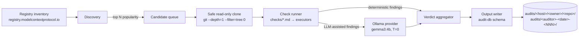

# Architecture — `mcp-verified` Phase 1

## 1. System flow



## 2. Module map

```
mcp_verified/
├── __init__.py          — package version
├── cli.py               — argparse entry point, dispatches subcommands
├── registry/
│   ├── __init__.py
│   ├── client.py        — registry.modelcontextprotocol.io API client
│   └── popularity.py    — popularity scoring (downloads / stars / age)
├── discovery/
│   ├── __init__.py
│   └── candidates.py    — candidate selection from registry inventory
├── clone/
│   ├── __init__.py
│   └── safe_clone.py    — git clone --depth=1 --filter=tree:0, scratch dir
├── checks/
│   ├── __init__.py
│   ├── loader.py        — load .md check definitions from /checks
│   ├── runner.py        — orchestrate check execution per candidate
│   └── executors/
│       ├── deterministic.py — regex / AST / semgrep-style pattern match
│       └── llm_assisted.py  — structured-output LLM call
├── providers/
│   ├── __init__.py
│   ├── base.py          — ABC: query(prompt, schema) -> dict
│   ├── ollama.py        — default, http://localhost:11434
│   ├── mock.py          — deterministic empty-finding fallback
│   ├── anthropic.py     — opt-in, gated by MCP_VERIFIED_PAID_PROVIDER_OPT_IN
│   ├── openai.py        — same opt-in gate
│   └── gemini.py        — same opt-in gate
├── verdict/
│   ├── __init__.py
│   ├── aggregator.py    — finding set → tier verdict (verified/caution/risky/unknown)
│   └── divergence.py    — same target two runs differ → discrepancy.md
├── output/
│   ├── __init__.py
│   ├── manifest.py      — audit-manifest.json writer (audit-db schema)
│   ├── assessment.py    — security-assessment.md writer
│   ├── findings.py      — per-finding markdown writer
│   └── exporter.py      — export-audit-db subcommand (tarball)
├── integrity/
│   ├── __init__.py
│   └── hash.py          — SHA-256 of cloned tree commit + check file hashes
└── budget/
    ├── __init__.py
    └── per_server.py    — 5-minute wall-clock budget enforcer
```

## 3. Boundary / Dependency map

| Module | Depends on | Allowed outbound network |
|---|---|---|
| `registry/client.py` | (stdlib only) | `https://registry.modelcontextprotocol.io/*` |
| `clone/safe_clone.py` | `git` binary | `https://github.com/*` |
| `checks/runner.py` | `checks/loader`, `providers/base` | (none, in-process) |
| `checks/executors/deterministic.py` | (stdlib + re) | (none) |
| `checks/executors/llm_assisted.py` | `providers/base` | (delegated) |
| `providers/ollama.py` | `urllib` | `http://localhost:11434` |
| `providers/anthropic.py` | `urllib` | `https://api.anthropic.com` — **opt-in only** |
| `providers/openai.py` | `urllib` | `https://api.openai.com` — **opt-in only** |
| `providers/gemini.py` | `urllib` | `https://generativelanguage.googleapis.com` — **opt-in only** |
| `output/exporter.py` | `tarfile` | (none) |
| Everything else | (none external) | (none) |

Phase 1 default code path = **only** `https://registry.modelcontextprotocol.io/*`, `https://github.com/*`, `http://localhost:11434` (AC-4.4).

## 4. Trade-offs

| Decision area | Path taken | Path rejected | Rationale |
|---|---|---|---|
| Stack | Python 3.11+ | TypeScript (sibling `mcp-guard`) | Reuses session-eval Python infra (provider ABC, pre-commit chain, audit_deps); audit scripting / batch orchestration plays to Python strengths; AIVSS reference impls are Python-first. See [ADR-001](adr/ADR-001-stack-python-311.md). |
| Candidate code handling | Read-only static analysis | Sandboxed execution (Docker / nsjail) | Phase 1 budget does not justify sandbox infrastructure. Static analysis covers the documented threat model (auth gap, credential exposure, SSRF, supply-chain). [ADR-003](adr/ADR-003-read-only-static-analysis.md). |
| Default LLM provider | Ollama `gemma3:4b`, `T=0` | Paid API default | Four-constraint posture mandates local-first; reproducibility (AC-3.4) requires deterministic-leaning settings. [ADR-004](adr/ADR-004-ollama-default-provider.md). |
| Output schema | audit-db compatible | Custom schema | Upstream contribution path = M3 strong-hire signal; consumers of audit-db (organizations evaluating MCP servers) get free coverage. [ADR-005](adr/ADR-005-audit-db-schema-compat.md). |
| Tier verdict naming | `verified` / `caution` / `risky` / `unknown` | Star-tier notation | Plain-language wording reads honestly without implying ordinal ranking. [ADR-006](adr/ADR-006-tier-verdict-naming.md). |
| Check seed | Fork mcpserver-audit `checks/` (Apache 2.0) | Zero-generation | Upstream provides 14 markdown checks with Obsidian-style frontmatter and good/bad examples; ~70% fit means fork-and-extend beats from-scratch (prior-art-first scanning). [ADR-007](adr/ADR-007-mcpserver-audit-checks-fork.md). |

## 5. Document zones

Repository-tracked files are public-safe by construction. Internal developer notes and session memos live outside the tracked tree:

| Zone | Path | Tracked? | Contents |
|---|---|---|---|
| Public spec | `spec.md`, `README.md`, `SECURITY.md`, `docs/**` | ✅ | EARS criteria, architecture, ADRs, evidence files |
| Public source | `mcp_verified/**`, `tests/**`, `scripts/**`, `checks/**` | ✅ | Implementation, tests, tooling |
| Public verdicts | `audits/**` (produced by `mcp-verified audit`) | ✅ | Per-server verdict registry |
| Local-only notes | `notes/private/**`, `.tmp/**` | ❌ (.gitignore) | Working drafts, scratchpads |
| Local-only config | `.claude/**`, `.env*` | ❌ (.gitignore) | Per-user tooling config, secrets |

The pre-commit `private-path-check` hook (Layer 2) blocks any tracked file from containing an absolute Windows user path, a local-config directory reference, or a documented internal-name abstraction. Layer 4 = `scripts/private_path_check.sh` manual sweep before `git push`.

## 6. Provider swap

The CLI selects a provider via the `MCP_VERIFIED_JUDGE_PROVIDER` environment variable:

```bash
# Default — Ollama at http://localhost:11434, gemma3:4b
mcp-verified audit --top 50

# Paid providers — explicit opt-in REQUIRED, even with key present
MCP_VERIFIED_PAID_PROVIDER_OPT_IN=1 \
  MCP_VERIFIED_JUDGE_PROVIDER=anthropic \
  ANTHROPIC_API_KEY=sk-... \
  mcp-verified audit --top 50

# Mock fallback — fired automatically if the configured provider is unreachable;
# annotates tools_used with "mock-provider" so verdicts can be filtered downstream
```

This matches the F-003 acceptance criteria (AC-3.3 mock fallback, AC-3.5 paid-provider refusal-by-default).

## 7. Phase boundaries

| Phase | Surface | Status |
|---|---|---|
| 1 | Source build (CLI + verdict registry + Ollama reproducibility) | Stage 3 design in progress |
| 1.5 | Dogfood probes B1–B4 (throughput / reproducibility / FP-FN / storage) | Pending Phase 1 completion |
| 2 | Demo video build (AivisSpeech + Playwright + ffmpeg, 12-scene canonical) | Pending Phase 1.5 |
| 3 | Public release gate (F-007 / AC-7.x) + `gh repo edit --visibility public` | Pending Phase 2 |
| 4 (optional) | Continuous re-audit, upstream contribution maintenance | Out of Phase 1 scope |
